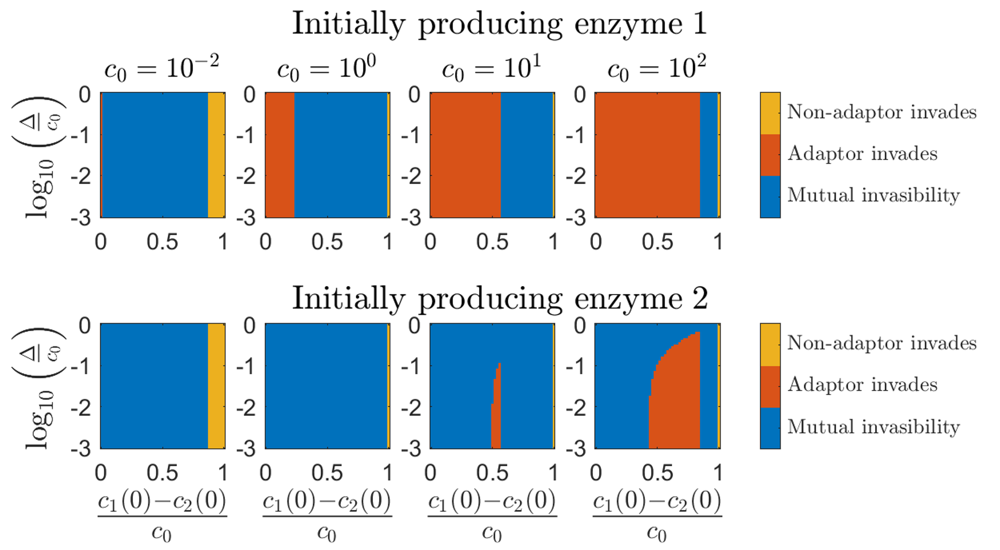

# Adaptation in a Serial-Dilution Co-culture

A consumer-resource modeling framework in a serial-dilution setup, where $m$ species compete for $p$ nutrients in a series of batches. At each batch, a nutrient mixture is supplied with a fixed composition $\lbrace c_i(t=0)\rbrace_{i=1}^p$ and total amount $c_0=\sum_i c_i(0)$. Similarly, a mixture of species $\lbrace\rho_\sigma(t=0)\rbrace_{\sigma=1}^m$ is added, with a fixed total amount $\rho_0=\sum_\sigma \rho_\sigma(0)$. Species grow until the depletion of nutrients, the culture is diluted, and a new batch starts, while keeping relative species populations.
Each species has a *metbolic strategy*, $\vec{\alpha}_ \sigma$, which is a vector of enzyme levels, while given a fixed enzyme budget $E_\sigma=\sum_i \alpha_{\sigma,i}$, leading to a metabolic trade-off. Nutrient consumption rates are given by $j_{\sigma,i}=\frac{c_i}{K+c_i}\alpha_{\sigma,i}$.

Dynamics within each batch are given by [^1]:
```math
\frac{d\rho_\sigma}{dt}=\rho_\sigma \sum_{i=1}^p j_{\sigma,i}   \quad,
```
```math
\frac{dc_i}{dt}=-\sum_{\sigma=1}^m \rho_\sigma j_{\sigma,i}   \quad.
```

The main feature of this framework is the inclusion of species *adaptation* to changing nutrient levels throughout the batch, by allowing the dynamics of the metabolic strategies, given by [^2]:
```math
\frac{d\alpha_{\sigma,i}}{dt}=(\mathbb{P}_{\sigma,i} E_\sigma-\alpha_{\sigma,i})\sum_{i'=1}^p j_{\sigma,i'}   \quad,
```
where $\mathbb{P}_{\sigma,i}$ is an indicator function which is 1 whenever species $\sigma$ produces enzyme $i$, and 0 otherwise. An adaptor population can only produce a single enzyme-type at a time.
The framework includes a few adaptation models (see [`app__simulations.m`](Code/app__simulations.m)) that operate under these guidelines, and is receptible to the addition of different models that may work in this context. Note that this adaptation feature is based on the *2-nutrient* case and thus is limited to $p=2$ (however, $p=1$ and $p>2$ dynmics can be simulated with no adaptation).

The dynamics are numerically solved for using *MATLAB*'s built-in `ode89` Runga-Kutta solver with adaptive step size. Simulations can be applied in a specific, instant manner, or by parallelly executing and collecting data from large sets of simulations, using the Split-Apply-Combine method (see [below](#split-apply-combine) for protocol).


## Script Index

> [!NOTE]
> **Here, the general structure of this repository's [*Code*](Code/) section and workflow are described. For a more specific script description, look at each script specifically.**

* [`odefun.m`](Code/odefun.m) and the [`eventfun*.m`](Code/) functions (one for each adaptation model) are the most basic functions, used by `ode89` to solve for the dynamics. [`odefun.m`](Code/odefun.m) contains the actual dynamics, while the [`eventfun*.m`](Code/) functions are used to track events througout the dynamics.

* The [`sim__*.m`](Code/) functions carry out the actual simulations (for simulation types, see [`app__simulations.m`](Code/app__simulations.m)). [`sim__batch.m`](Code/sim__batch.m) is the most basic of these, which solves for the dynamics within each batch, and is executed by the other, higher [`sim__*.m`](Code/) functions (except for [`sim__invasibility_map.m`](Code/sim__invasibility_map.m) which uses it indirectly). All functions may optionally plot the results, and (except for [`sim__batch.m`](Code/sim__batch.m)) save the data. The high-end functions [`sim__serial__interbatch.m`](Code/sim__serial__interbatch.m), [`sim__serial__full_dynamics.m`](Code/sim__serial__full_dynamics.m), and [`sim__invasibility_map.m`](Code/sim__invasibility_map.m) are executed using the apply scripts (see below).

* The [`app__*.m`](Code/) scripts are the main scripts that apply the simulations, and are directly used by the user for setting parameter values and executing the simulations. [`app__simulations.m`](Code/app__simulations.m) is used for running specific simulations, whereas the [`app__slurm__*.cmd`](Code/) files are used for implementing large simulation sets in parallel (see [below](#split-apply-combine)).

* The [`plot__*.m`](Code/) functions are used to plot the dynamics or other results (raw or collected data). Some are 'raw' plotters, which are used directly by the [`sim__*.m`](Code/) functions to plot the results from a single simulation, and have a name corresponding to their simulation function. Others may collect the data from large sets of simulations, either by reading raw-data files or a collected-data table (in the case of inter-batch simulations).


### Split-Apply-Combine

A common approach to data-analysis, aiming to implement large simulation sets in an orderly and effective way:

1. **Split** - Produce a parameter table, such that each row contains values for all moving parameters (that vary between different simulations) for a certain simulation in the set, and a template-file to plug simulation parameters into.
   <br> This is done here by the [`split_runs__*.m`](Code/) functions.

3. **Apply** - Perform all jobs using a script that allocates resources and executes them independently in parallel. Each job uses the parameter template to plug values from a certain row in the split table, and performs a simulation. All set-simulations are directed to save raw data in the same directory.
   <br> This is done here by the [`app__slurm__*.cmd`](Code/) files.

4. **Combine** - Collect data into a table synchronously from all saved raw-data files in the simulation set. Analyze/plot various dependencies.
   <br> Collecting is done here either by using [`collect_data__interbatch.m`](Code/collect_data__interbatch.m) in the case of inter-batch simulations, or directy by some of the [`plot__*.m`](Code/) functions in other cases.

The power of this method is in its modular nature – jobs can be applied independently; data from existing files can be collected independently at any point in time, regardless of currently running jobs.


#### Protocol:
  $\quad\quad\quad$  [`split_runs__*.m`](Code/)  $\quad \longmapsto \quad$  [`app__slurm__*.cmd`](Code/)  $\quad \longmapsto \quad$  [`collect_data__interbatch.m`](Code/collect_data__interbatch.m)*  $\quad \longmapsto \quad$  [`plot__*.m`](Code/)

\* If needed 


## Data and Plots

Data and corresponding figures are automatically saved with easily identifiable, corresponding file names (including the simulation type and important parameter values), in the [*Data*](Data/) and [*Plots*](Plots/) directories, respectively. Their general structure is embedded and a generic sample of data and figures is included here inside both directories.

Here are some of these figures:


<figure>
   
   <figcaption> 1 Adaptor - Metabolic Strategy distributions (Tip: to simulate a single species, use 2 identical species) </figcaption>
</figure>

<figure>
   
   <figcaption> Adaptor VS Non-Adaptor - Invasibility Character </figcaption>
</figure>

<figure>
   
   <figcaption> 2 Adaptors - Steady-State Populaion Bias VS Sensing Tolerances </figcaption>
</figure>


## References

[^1]: Amir Erez, Jaime G. Lopez, Benjamin G. Weiner, Yigal Meir, and Ned S. Wingreen. *Nutrient levels and trade-offs control diversity in a serial dilution ecosystem*. **eLife**, September 2020 [(Go to paper)](https://doi.org/10.7554/eLife.57790).

[^2]: Amir Erez, Jaime G. Lopez, Yigal Meir, and Ned S. Wingreen. *Enzyme regulation and mutation in a model serial-dilution ecosystem*. **Physical Review E**, October 2021 [(Go to papar)](https://pubmed.ncbi.nlm.nih.gov/34781576/).
